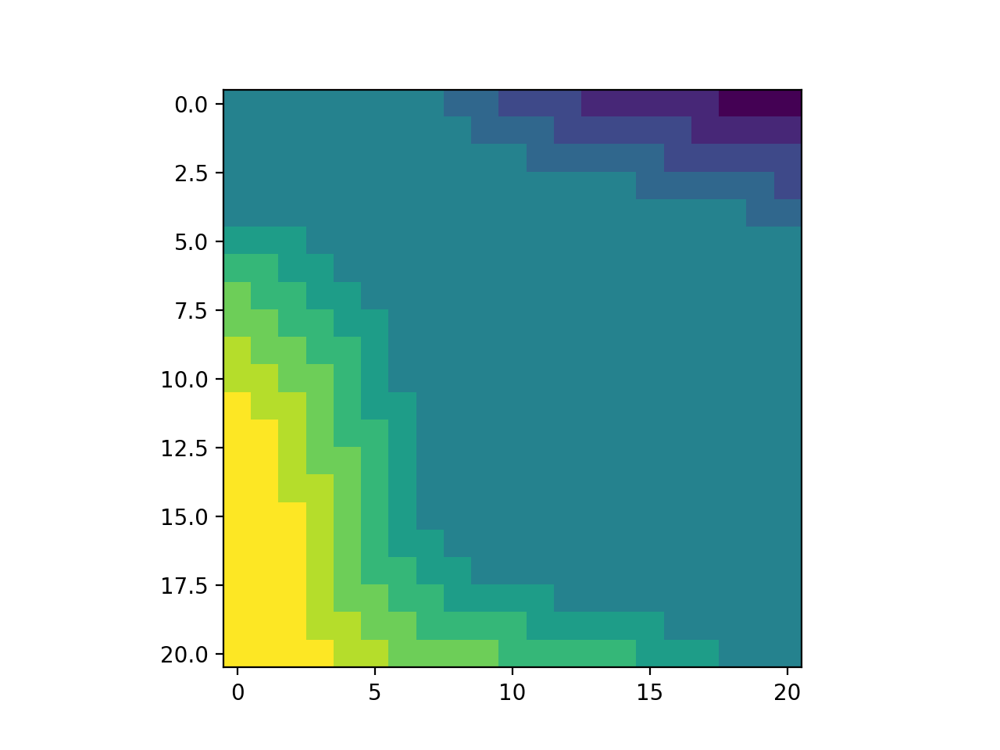

# policy_iteration_car_rental

Implements the [Jack's Car Rental](http://www.incompleteideas.net/sutton/book/first/4/node4.html) example in Sutton and Barto - 'An Introduction to Reinforcement Learning',
and obtains the correct results.

Here are the final value estimates after four policy improvement iterations:

In the figures above, the value estimates range from 421 to 636 and the policy ranges from -5 to 5.
